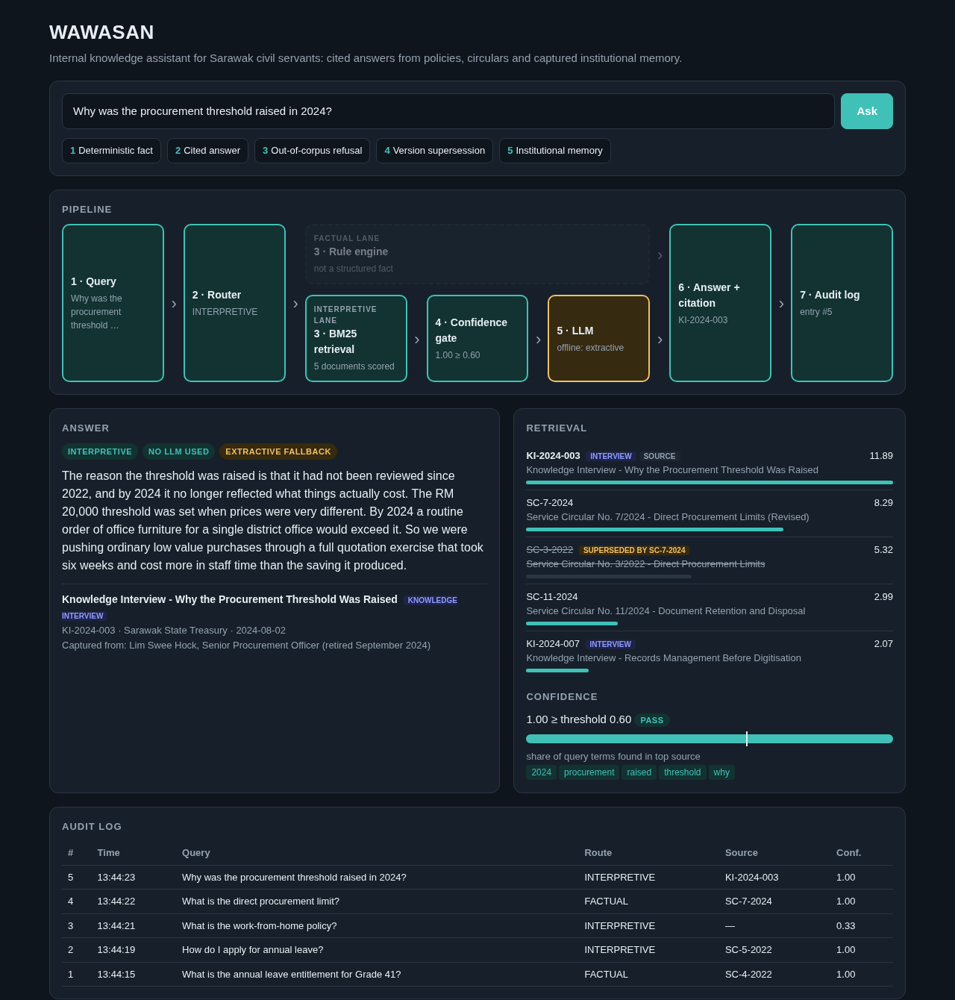
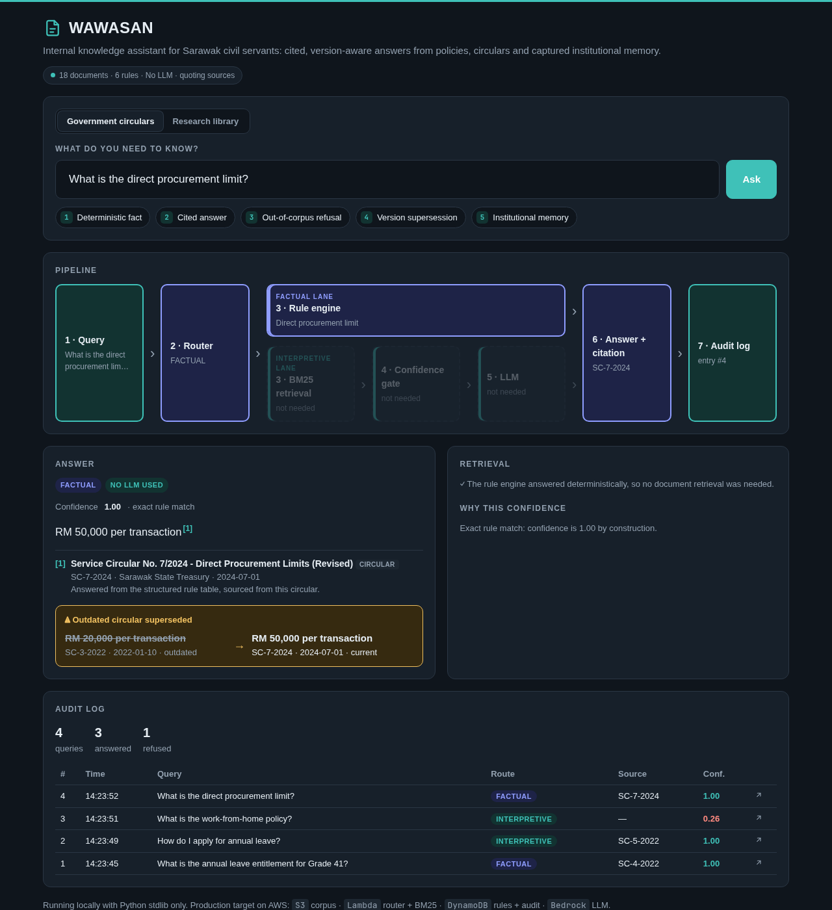
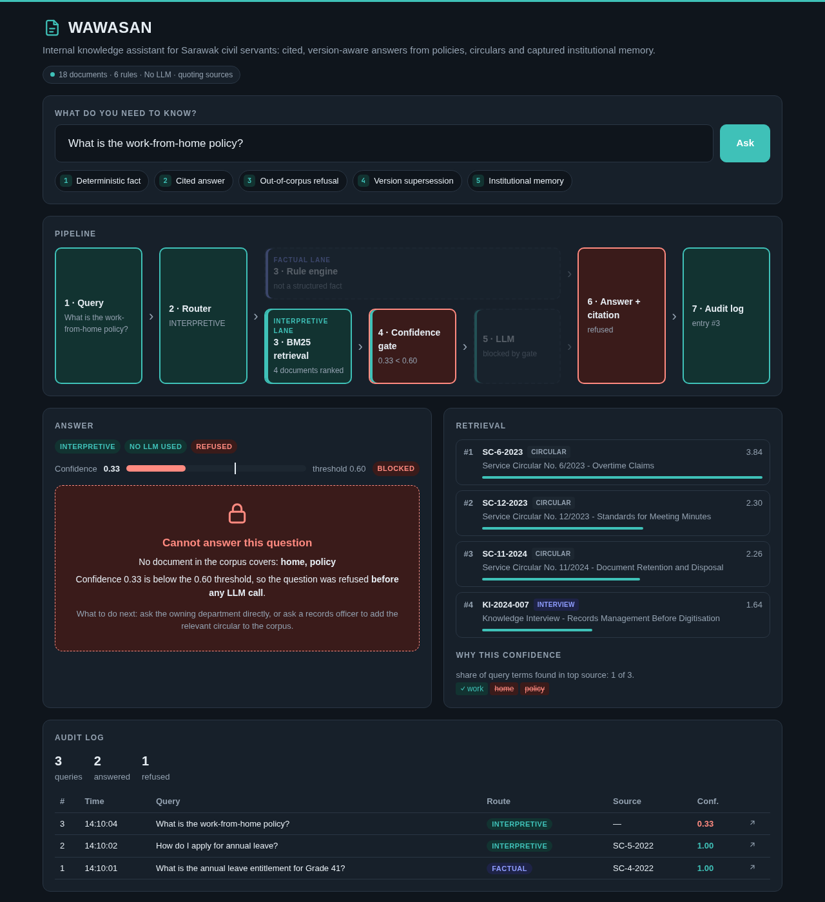

# WAWASAN — Government Knowledge Intelligence

**Mayao Labs · AWS Student Community Day Kuching 2026 (#SCDKuching2026)**

Government agencies hold thousands of policies, SOPs, circulars and meeting minutes, but officers can't find the right one quickly, can't tell which version is current, and lose the reasoning behind decisions when experienced staff retire.

WAWASAN is an internal knowledge assistant for Sarawak civil servants. You ask a question in plain English and it returns a **cited** answer: the source document, its version date and the department that owns it. It answers structured facts from a deterministic rule table rather than letting an LLM guess them. It recognises when a circular has been superseded. When the answer isn't in the corpus it **says so instead of guessing**.

## Team

- Shoaib Ur Rahman Syed
- Kazuki Soma
- Anantojo Mendan

## Screenshots

**Institutional memory:** a *why* question answered from a captured interview with a retired officer. No circular contains this. The superseded 2022 circular appears in retrieval but is struck through.



**Version supersession:** the rule engine answers from the current circular and shows what it replaced. No LLM involved.



**Out-of-corpus refusal:** the confidence gate blocks the question before any LLM call is made.



The other two scenarios are in [`demo/screenshots/`](demo/screenshots/).

## The five scenarios

| # | Scenario | Question | Path | LLM needed? |
|---|---|---|---|---|
| 1 | Deterministic fact | What is the annual leave entitlement for Grade 41? | Router → rule engine | No |
| 2 | Cited answer | How do I apply for annual leave? | Router → BM25 → confidence gate → LLM | Optional |
| 3 | Out-of-corpus refusal | What is the work-from-home policy? | Router → BM25 → **gate blocks** | No |
| 4 | Version supersession | What is the direct procurement limit? | Router → rule engine (current circular, replaced one shown) | No |
| 5 | Institutional memory | Why was the procurement threshold raised in 2024? | Router → BM25 → knowledge interview | Optional |

**All five work with no LLM at all.** Without an API key, scenarios 2 and 5 fall back to quoting the best-matching passage of the cited source. An LLM only rewrites that passage into a summary. This is a design choice rather than a workaround: policy facts should never depend on a model guessing, and a demo should not depend on conference wifi.

## How it works

```
Query → Router ─┬─ FACTUAL ──────→ Rule engine ───────────────────────────┬→ Answer + citation → Audit log
                └─ INTERPRETIVE ─→ BM25 retrieval → Confidence gate → LLM ┘
```

- **Router.** Questions containing structured-fact markers (*grade, entitlement, limit, rate…*) go to the rule engine. *Why* questions always go to retrieval, because a lookup table cannot explain a rationale.
- **Rule engine.** A table of exact values, each pointing at the circular it came from.
- **BM25 retrieval** over the document corpus. Superseded documents are still retrieved but never used as the answer.
- **Confidence gate.** This is the share of the question's key terms that appear in the top source. Below 0.60, the system refuses before any LLM call is made.
- **Audit log.** Every query, answer, source and confidence score is recorded.

## Run it

Requires Python 3.10+. **No packages to install**: it uses only the standard library.

```bash
python3 demo/app.py            # http://localhost:8000
python3 demo/app.py --selftest # checks routing, ranking, refusal, supersession
```

Optional LLM answer generation, either with Amazon Bedrock or with Groq's free tier:

```bash
# Amazon Bedrock: needs AWS CLI credentials and model access enabled for Claude Haiku 4.5
LLM_PROVIDER=bedrock AWS_REGION=ap-southeast-1 python3 demo/app.py

# Groq free tier (no credit card)
GROQ_API_KEY=your_key python3 demo/app.py
```

Bedrock defaults to the `global.anthropic.claude-haiku-4-5-20251001-v1:0` inference profile; override it with `BEDROCK_MODEL_ID`. A *global* profile may process requests outside the chosen region. A production deployment that needs data residency would use an in-region model or geography-specific profile instead.

Open `http://localhost:8000/?q=your+question` to run a question directly from the URL.

## AWS deployment target

The demo runs locally. Each component maps one-to-one onto AWS, and the four functions in `demo/app.py` that touch storage or the LLM (`load_corpus`, `load_rules`, `call_llm`, `log_audit`) are the swap points:

| Demo today | On AWS |
|---|---|
| `corpus/*.md` | Amazon S3 |
| Router + BM25 (Python) | AWS Lambda behind a Function URL |
| Rule table (dict) | Amazon DynamoDB |
| Groq / extractive fallback | Amazon Bedrock, Claude Haiku 4.5 (already supported via `LLM_PROVIDER=bedrock`) |
| SQLite audit log | Amazon DynamoDB + CloudWatch |

**Estimated cost to run the demo on AWS: about US$1.** That covers ~300 queries at ~$0.003 each on Bedrock Haiku 4.5. Lambda, DynamoDB and S3 stay within the free tier at this volume. We deliberately do **not** use OpenSearch Serverless: at this corpus size BM25 inside Lambda is enough, and OpenSearch bills continuously (~$0.48/hr) whether it is queried or not.

## Roadmap

**Phase 2: production pilot (one agency)**
- Bedrock for answer generation, deployed on Lambda, DynamoDB and S3 as above
- Hybrid retrieval (BM25 + dense embeddings) once the corpus outgrows keyword search
- Role-based access (Amazon Cognito), so classified circulars are visible only to cleared roles
- Bedrock Guardrails for content filtering
- An admin interface for maintaining the rule table, which flags rules whose source circular has changed
- **Bahasa Malaysia + English** queries and documents. The demo is English-only.
- **Knowledge capture pipeline (SOL-03).** Retiring officers record exit interviews, transcribed by Amazon Transcribe. AI-guided follow-up questions fill the gaps, and the result is structured into indexed documents. The demo already shows the *output* of this pipeline: scenario 5 answers from a captured interview.

**Phase 3: ecosystem**
- Knowledge graph (Amazon Neptune) for cross-agency relationships, e.g. "Circular X changed, and these four SOPs reference it". It sits outside the live query path to keep latency down.
- Federated search across agencies without moving their data
- Integration with Dayang, Sarawak's citizen-facing assistant

## Research and design

- [`research/00-SYNTHESIS.md`](research/00-SYNTHESIS.md) covers the problem at international, Malaysian and Sarawak level, with seven recurring pain factors.
- [`research/solutions/`](research/solutions/) contains six candidate solutions and their ratings.
- [`PRODUCT-DESIGN.md`](PRODUCT-DESIGN.md) is the full product design.

## Note on the demo data

Every document in `demo/corpus/` was written for this demo. The circular numbers, values and interviewed officers are **fictional** and do not represent actual Sarawak government policy or real people.
