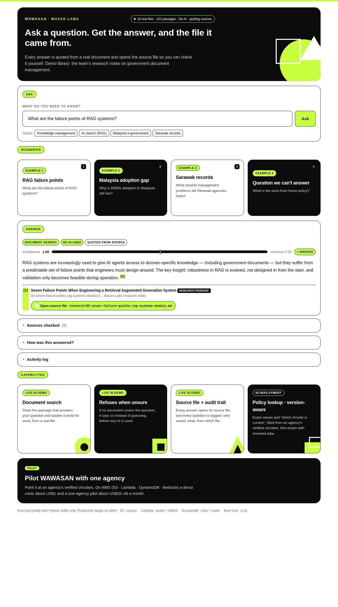
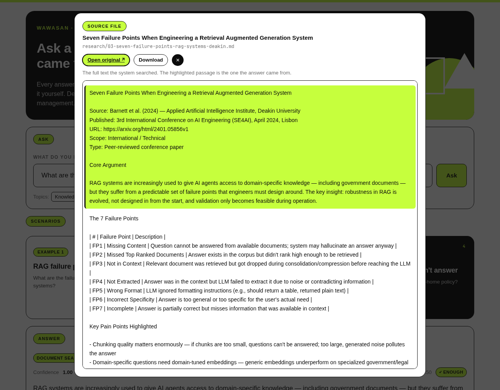
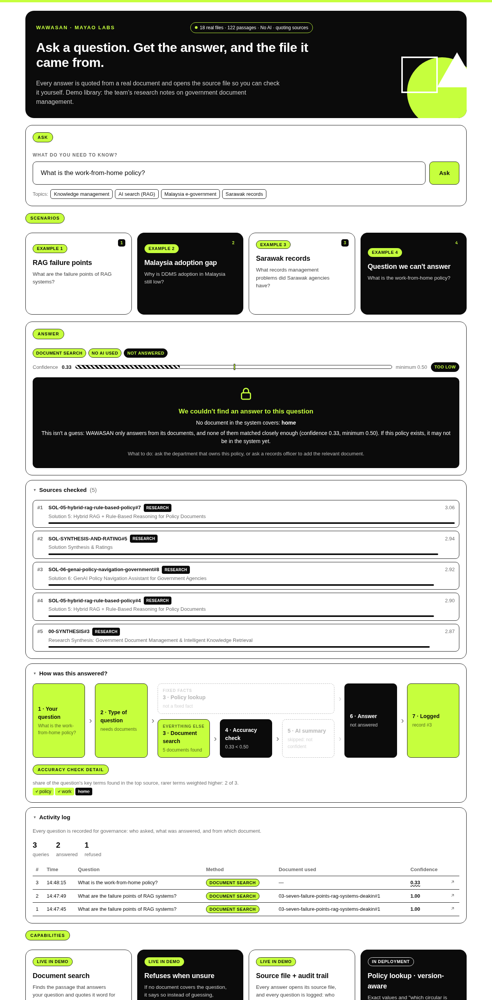
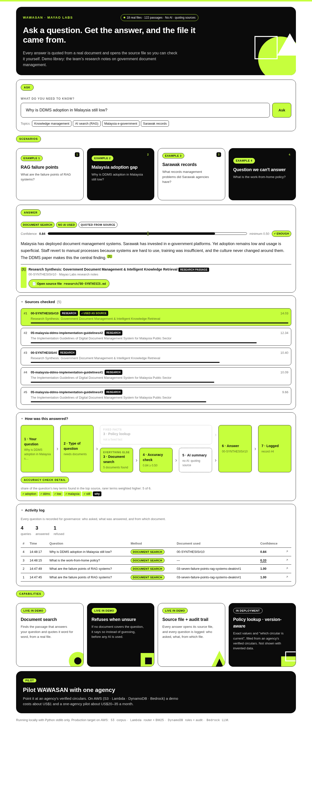

# WAWASAN — Government Knowledge Intelligence

**Mayao Labs · AWS Student Community Day Kuching 2026 (#SCDKuching2026)**

Government agencies hold thousands of policies, SOPs, circulars and meeting minutes, but officers can't find the right one quickly, can't tell which version is current, and lose the reasoning behind decisions when experienced staff retire.

WAWASAN is an internal knowledge assistant for Sarawak civil servants. You ask a question in plain English, and it returns an answer **quoted from a real document**. It names the exact file and shows that file with the passage highlighted, so anyone can check the answer. When no document covers the question, it **says so instead of guessing**.

**Nothing in this demo is invented.** It searches only real files that exist in this repository: the team's research notes, which cite published studies.

## Team

- Shoaib Ur Rahman Syed
- Kazuki Soma
- Anantojo Mendan

## Screenshots

**A cited answer with its source file:** the answer is quoted from the passage, and the file it came from opens below with that passage highlighted.



**Click "Open source file" and the real file pops up,** with the passage the answer came from highlighted, and buttons to open or download the original:



**A question the documents don't cover:** the accuracy check refuses it before any AI is used.



**The full pipeline,** opened via "How was this answered?", which the presenter can expand:



## What it searches

The 18 research notes in [`research/`](research/). Each one summarises a published study or report and cites it (for example Barnett et al. 2024, *Seven Failure Points When Engineering a RAG System*, arXiv). Long documents are split into ~180-word passages, so every answer points to an exact passage, not a whole paper. Any **PDF dropped into `demo/library/`** is indexed on the next restart, with page-level citations (text extracted by `pdftotext` from poppler-utils).

Example questions: *What are the failure points of RAG systems?* · *Why is DDMS adoption in Malaysia still low?* · *What records management problems did Sarawak agencies have?* · *What is the work-from-home policy?* (refused: no document covers it)

**Every answer works with no AI at all.** Without an LLM, the answer is the best-matching passage quoted word for word. The self-test checks that a quoted answer appears verbatim in the cited passage. An LLM, if connected, only rewrites that passage into a summary.

## How it works

```
Query → Router ─┬─ FACTUAL ──────→ Rule engine ───────────────────────────┬→ Answer + citation → Audit log
                └─ INTERPRETIVE ─→ BM25 retrieval → Confidence gate → LLM ┘
```

- **Router.** Questions containing structured-fact markers (*grade, entitlement, limit, rate…*) go to the rule engine. *Why* questions always go to retrieval, because a lookup table cannot explain a rationale.
- **Rule engine (policy lookup).** A table of exact values, each pointing at the official circular it came from. **It is empty in this demo**, because we only use verified real documents and have no official circulars yet. Every question therefore goes to document search. In deployment it is filled from an agency's verified circulars.
- **BM25 retrieval** over the document passages. Documents marked as superseded are still retrieved but never used as the answer (no real documents in the demo are superseded yet).
- **Confidence gate.** This is the share of the question's key terms that appear in the top source, with rarer, more specific terms weighted higher. Below 0.50, the system refuses before any LLM call is made.
- **Audit log.** Every query, answer, source and confidence score is recorded.

## Run it

Requires Python 3.10+. **No packages to install**: it uses only the standard library.

```bash
python3 demo/app.py            # http://localhost:8000
python3 demo/app.py --selftest # checks real files, ranking, refusal, verbatim quotes
```

Optional LLM answer generation, either with Amazon Bedrock or with Groq's free tier:

```bash
# Amazon Bedrock: needs AWS CLI credentials and model access enabled for Claude Haiku 4.5
LLM_PROVIDER=bedrock AWS_REGION=ap-southeast-1 python3 demo/app.py

# Groq free tier (no credit card)
GROQ_API_KEY=your_key python3 demo/app.py
```

See [Connecting Amazon Bedrock](#connecting-amazon-bedrock) for the full setup.

## Connecting Amazon Bedrock

The demo calls Bedrock through the AWS CLI, so there is nothing extra to install in Python. You need the AWS CLI v2, an AWS account, and about 10 minutes.

**1. Create credentials with Bedrock permission.** In the IAM console, create a user (or use an existing one) and attach a policy that allows `bedrock:InvokeModel`. The Converse API the demo uses requires this permission. For a demo this is enough:

```json
{
  "Version": "2012-10-17",
  "Statement": [{ "Effect": "Allow", "Action": "bedrock:InvokeModel", "Resource": "*" }]
}
```

Scope `Resource` down to the specific model and inference-profile ARNs for anything beyond a demo. Then create an access key for the user.

**2. Configure the CLI** in your own terminal. Never put keys in the repo.

```bash
aws configure            # access key, secret key, region: ap-southeast-1, output: json
aws sts get-caller-identity   # should print your account and user
```

**3. Enable the model.** In the Bedrock console (region `ap-southeast-1`), check that **Claude Haiku 4.5** is available to your account. If the console shows a *Model access* page, request access there. The first use of an Anthropic model may ask for a short one-time use-case form.

**4. Test Bedrock directly:**

```bash
aws bedrock-runtime converse --region ap-southeast-1 \
  --model-id global.anthropic.claude-haiku-4-5-20251001-v1:0 \
  --messages '[{"role":"user","content":[{"text":"Reply with OK"}]}]'
```

If you get a JSON response containing `"OK"`, you're connected.

**5. Run the demo on Bedrock:**

```bash
LLM_PROVIDER=bedrock AWS_REGION=ap-southeast-1 python3 demo/app.py
```

The startup line should say `LLM: Amazon Bedrock`. Answers then show an **AI summary · Bedrock** badge, and the *Quoted from source* badge disappears.

**Troubleshooting.** Errors are printed in the terminal running `app.py`. The demo keeps working with extractive answers while you fix them.

| Error | Fix |
|---|---|
| `NoCredentials` | Step 2 wasn't done in the shell running the demo |
| `AccessDeniedException` | The IAM policy (step 1) or model access (step 3) is missing |
| `ValidationException` about the model identifier | Copy the Haiku 4.5 inference profile ID shown in the Bedrock console for your region, and set `BEDROCK_MODEL_ID=<that id>` |

**Notes**
- The default `global.` inference profile may process requests outside `ap-southeast-1`. A deployment that needs data residency would use an in-region model or a geography-specific profile instead.
- Cost is about US$0.003 per answered question. Refused questions never call the model.

Open `http://localhost:8000/?q=your+question` to run a question directly from the URL.

## AWS deployment target

The demo runs locally. Each component maps one-to-one onto AWS, and the functions in `demo/app.py` that touch storage or the LLM (`load_library`, `call_llm`, `log_audit`) are the swap points:

| Demo today | On AWS |
|---|---|
| `research/*.md`, `demo/library/` | Amazon S3 |
| Router + BM25 (Python) | AWS Lambda behind a Function URL |
| Rule table (empty until verified circulars exist) | Amazon DynamoDB |
| Groq / extractive fallback | Amazon Bedrock, Claude Haiku 4.5 (already supported via `LLM_PROVIDER=bedrock`) |
| SQLite audit log | Amazon DynamoDB + CloudWatch |

**Estimated cost to run the demo on AWS: about US$1.** That covers ~300 queries at ~$0.003 each on Bedrock Haiku 4.5. Lambda, DynamoDB and S3 stay within the free tier at this volume. We deliberately do **not** use OpenSearch Serverless: at this corpus size BM25 inside Lambda is enough, and OpenSearch bills continuously (~$0.48/hr) whether it is queried or not.

## Roadmap

**Phase 2: production pilot (one agency)**
- Bedrock for answer generation, deployed on Lambda, DynamoDB and S3 as above
- Hybrid retrieval (BM25 + dense embeddings) once the corpus outgrows keyword search
- Role-based access (Amazon Cognito), so classified circulars are visible only to cleared roles
- Bedrock Guardrails for content filtering
- An admin interface for maintaining the rule table, which flags rules whose source circular has changed
- **Bahasa Malaysia + English** queries and documents. The demo is English-only.
- **Knowledge capture pipeline (SOL-03).** Retiring officers record exit interviews, transcribed by Amazon Transcribe. AI-guided follow-up questions fill the gaps, and the result is structured into indexed documents that WAWASAN searches like any other file.
- Filling the policy lookup table and version (supersession) links from an agency's verified official circulars

**Phase 3: ecosystem**
- Knowledge graph (Amazon Neptune) for cross-agency relationships, e.g. "Circular X changed, and these four SOPs reference it". It sits outside the live query path to keep latency down.
- Federated search across agencies without moving their data
- Integration with Dayang, Sarawak's citizen-facing assistant

## Research and design

- [`research/00-SYNTHESIS.md`](research/00-SYNTHESIS.md) covers the problem at international, Malaysian and Sarawak level, with seven recurring pain factors.
- [`research/solutions/`](research/solutions/) contains six candidate solutions and their ratings.
- [`PRODUCT-DESIGN.md`](PRODUCT-DESIGN.md) is the full product design.

## Note on the demo data

The demo searches only real files in this repository: the team's research notes in `research/`, plus any PDFs placed in `demo/library/`. An earlier version used invented sample circulars. They were removed because the demo must not present fabricated policy as fact.
